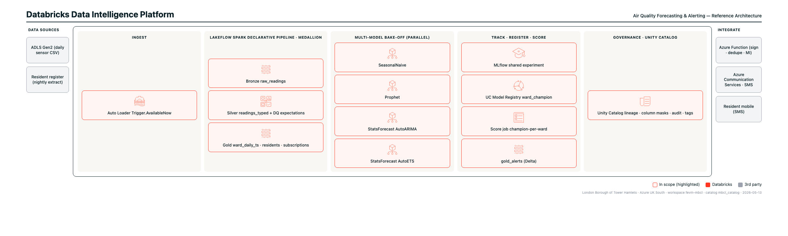

# Predictive Analytics Demo — Forecasting & Alerting

A complete, end-to-end Databricks reference demo for local-authority sensor forecasting. It shows how to forecast a daily metric (here, PM2.5) per geographic unit (here, ward), register a champion model per unit in Unity Catalog, and generate alerts when forecasts cross regulatory thresholds. Built on **batch data** running on **Azure Databricks**.

Everything in this repo is a **Databricks Asset Bundle**. One command (`databricks bundle deploy`) creates the Lakeflow Declarative Pipeline, the orchestration job, the MLflow experiment, and points the notebooks at your catalog.

The data is **synthetic** and **deterministic** (fixed seeds, 20 wards × 365 days). No real-world resident data is included.

---

## Contents

| Folder | What's in it |
|---|---|
| `notebooks/` | The four working notebooks — explore, train & compare, score & alert, team collab patterns |
| `pipeline/` | The Lakeflow Declarative Pipeline (bronze → silver → gold) |
| `dashboard/` | The Lakeview dashboard JSON (Air Quality Resident Alerts — Live) |
| `data_gen/` | Synthetic data generator (Python) — produces the CSVs |
| `architecture/` | Reference architecture diagrams (PNG + SVG + Python source) |
| `docs/` | Team collaboration model, modelling rationale, ops runbook |
| `bundle/` | Bundle-level helper docs |
| `databricks.yml` | The Asset Bundle spec — **this is the file you'll edit** |

---

## How to run this end-to-end

This section is deliberately verbose. **If a step doesn't work, the troubleshooting table near the bottom probably has the answer.** Don't skip steps.

### Prerequisites

- A Databricks workspace on Azure with **Unity Catalog enabled** and at least one **Serverless SQL Warehouse**
- Permission to create catalogs / schemas / jobs / pipelines / experiments in that workspace
- A laptop with **Python 3.10+** and **`curl`** (macOS has both by default; Windows users should install Python from python.org)

> **You do not need to know Python or Spark to deploy this.** Everything is one CLI command. The Python only matters if you want to modify the notebooks afterwards.

---

### Step 1 — Install the Databricks CLI

Open Terminal (macOS) or PowerShell (Windows).

**macOS / Linux:**
```bash
brew tap databricks/tap
brew install databricks
```

If you don't have `brew`, use the direct installer:
```bash
curl -fsSL https://raw.githubusercontent.com/databricks/setup-cli/main/install.sh | sh
```

**Windows (PowerShell):**
```powershell
winget install Databricks.DatabricksCLI
```

**Verify the install:**
```bash
databricks --version
```
You should see `Databricks CLI v0.235.0` or later. **If you see anything below v0.235, upgrade — older versions cannot deploy bundles cleanly.**

---

### Step 2 — Authenticate against your Databricks workspace

```bash
databricks auth login --profile demo --host https://adb-<YOUR-WORKSPACE-ID>.azuredatabricks.net
```

Replace `<YOUR-WORKSPACE-ID>` with the actual ID of your workspace (the number that appears in the URL when you log into Databricks). Example:
```bash
databricks auth login --profile demo --host https://adb-1234567890123456.7.azuredatabricks.net
```

This will:
1. Open a browser tab
2. Ask you to sign in with your workspace account
3. Ask you to click **Allow**
4. Close the browser and return to the terminal

You should see `Profile demo was successfully saved`.

**Verify auth worked:**
```bash
databricks current-user me --profile demo
```
You should see a JSON blob with your email address. If you don't, re-run the login command.

---

### Step 3 — Clone this repo

```bash
git clone https://github.com/TozDBX/predictive-analytics-demo.git
cd predictive-analytics-demo
```

---

### Step 4 — Edit `databricks.yml` for your environment

Open `databricks.yml` in any text editor (VS Code, Notepad++, TextEdit). You need to change **four lines** in the `prod` target near the bottom of the file:

```yaml
  prod:
    mode: production
    workspace:
      host: https://adb-<YOUR-WORKSPACE-ID>.azuredatabricks.net   # (1) put your workspace URL here
    run_as:
      service_principal_name: predictive-demo-deploy-sp          # (2) optional; remove this block for first run
    variables:
      catalog: my_catalog                                 # (3) the Unity Catalog name you want to write into
      schema: air_quality_forecast                                # (4) the schema inside that catalog
      alert_dry_run: "false"                                      #     keep this — flips real SMS sending on
```

**For your first deploy, keep things simple:**
- Set `host` to your workspace URL (the same URL you used in Step 2)
- **Delete the `run_as:` block** for now — that requires a service principal setup. Deploying as yourself works fine for the first run.
- Set `catalog` to a catalog you have CREATE rights on. If unsure, ask your platform admin or use a sandbox catalog.
- Leave `schema` as `air_quality_forecast` — the bundle creates it for you.

**Also change the `email_notifications` block** (around line 55):
```yaml
      email_notifications:
        on_failure:
          - toz.ozturk@databricks.com   # change this to your email (or a DL)
```

---

### Step 5 — Generate the synthetic data and upload it

The bundle needs the CSV input files in a Unity Catalog Volume before it can run.

**Generate the CSVs locally:**
```bash
cd data_gen
python3 generate.py
cd ..
```
This creates `data/*.csv` in the repo root.

**Create the catalog / schema / volume in Databricks**, then upload the CSVs. Replace `MY_CATALOG` with the catalog you set in Step 4:

```bash
databricks --profile demo catalogs create MY_CATALOG
databricks --profile demo schemas create th_hub MY_CATALOG
databricks --profile demo volumes create MY_CATALOG.th_hub raw_csv

for f in data/*.csv; do
  databricks --profile demo fs cp "$f" "dbfs:/Volumes/MY_CATALOG/th_hub/raw_csv/$(basename $f)" --overwrite
done
```

**Windows PowerShell users** — the `for f in ...` loop is bash. Use this instead:
```powershell
Get-ChildItem data\*.csv | ForEach-Object {
  databricks --profile demo fs cp $_.FullName "dbfs:/Volumes/MY_CATALOG/th_hub/raw_csv/$($_.Name)" --overwrite
}
```

---

### Step 6 — Validate the bundle

This dry-runs the deploy without touching anything. **Always do this first.**

```bash
databricks bundle validate -t prod --profile demo
```

You should see something like:
```
Name: th_air_quality_forecasting
Target: prod
Workspace: https://adb-<your-id>.azuredatabricks.net
User: you@your-org.example.com
Path: /Workspace/Shared/.bundle/prod/th_air_quality_forecasting

Validation OK!
```

**If validation fails**, the error message will tell you what's wrong — usually a wrong host URL, missing catalog, or a typo in `databricks.yml`. Fix it and re-run.

---

### Step 7 — Deploy the bundle

```bash
databricks bundle deploy -t prod --profile demo
```

This takes **30–60 seconds**. It creates:
- A Lakeflow Declarative Pipeline named `th_air_quality_forecast_pipeline`
- A Job named `th_air_quality_daily`
- An MLflow experiment at `/Shared/predictive-demo/air_quality_forecasting/experiments/multi_model_bakeoff`
- A staging folder under `/Workspace/Shared/.bundle/prod/th_air_quality_forecasting/` with the source files

When it finishes you'll see `Deployment complete!`.

---

### Step 8 — Run the daily job once

```bash
databricks bundle run th_air_quality_daily -t prod --profile demo
```

This kicks off the full chain: ingest → train & compare → score & alert. It takes **8–15 minutes** depending on warehouse size. You'll get a clickable link in the terminal output that goes straight to the job run page in the Databricks UI.

---

### Step 9 — See what got built

In your workspace UI:

1. **Workflows → Pipelines** → `th_air_quality_forecast_pipeline` → click the latest run. See the DAG, the DQ expectations, lineage.
2. **Workflows → Jobs** → `th_air_quality_daily` → the multi-task chain.
3. **Experiments** (left sidebar) → `multi_model_bakeoff` → compare runs, group by `ward_id`, sort by sMAPE.
4. **Catalog Explorer** → your catalog → `air_quality_forecast` → see `ward_champion` (Models tab) and `gold_alerts` (Tables tab).
5. **SQL Editor** — paste this for an instant "worst wards" view:
   ```sql
   SELECT ward_name, ROUND(AVG(pm25_ugm3), 1) AS avg_pm25_30d
   FROM <YOUR-CATALOG>.th_air_quality.gold_daily_ts
   WHERE reading_date >= current_date() - INTERVAL 30 DAYS
   GROUP BY ward_name
   ORDER BY avg_pm25_30d DESC
   LIMIT 10
   ```

---

## Need help running it? Three options

1. **Read this README all the way through first** — most issues are covered in the troubleshooting table below.
2. **Open a GitHub issue** on this repo and describe what step failed.
3. **Message Toz directly** — `toz.ozturk@databricks.com`. Happy to do a screen-share to get you unblocked.

---

## Troubleshooting

| Symptom | Fix |
|---|---|
| `databricks: command not found` | The CLI didn't install on your PATH. Close your terminal, open a new one, try again. On Windows, you may need to restart your terminal session for `winget` installs to take effect. |
| `Error: cannot resolve host` | Your workspace URL in `databricks.yml` is wrong. Copy it from your browser address bar after logging in. |
| `Error: 401 Unauthorized` | Your auth token expired. Re-run `databricks auth login --profile demo --host <your-host>`. |
| `Error: permission denied creating catalog` | Your account doesn't have CREATE CATALOG rights. Either ask an admin to create it, or change the catalog in `databricks.yml` to an existing one you can write into. |
| Pipeline fails on `bronze_readings` | The CSVs aren't in the right Volume path. Re-run Step 5 and confirm with `databricks --profile demo fs ls dbfs:/Volumes/<catalog>/th_hub/raw_csv/`. |
| `Workspace MLflow experiments cannot be created in Git folders` | Confirm the experiment path in `databricks.yml` is under `/Shared`, not under `/Workspace/Users/<your>/repo/...`. |
| Anything else | Open a GitHub issue, or message Toz. |

---

## What to change before this is production-ready

This is a **reference demo**, not production code. Before pointing real residents at it, work through this list:

- [ ] Replace synthetic data with your real sensor feed (point Auto Loader at your ADLS Gen2 path)
- [ ] Replace the synthetic `residents` / `subscriptions` tables with your actual resident-comms database
- [ ] Wire up a real Azure Communication Services webhook (the demo logs the payload but doesn't send)
- [ ] Add a service principal for the bundle deploy (the `run_as` block in `databricks.yml`)
- [ ] Set up CI — PR to `develop` deploys to dev target, merge to `main` deploys to prod target
- [ ] Set up Unity Catalog column masks on `phone_e164` so only the alert service principal sees plain text
- [ ] Add Lakehouse Monitoring on `gold_daily_ts` (TimeSeries profile, slice on `ward_id`)
- [ ] Add Lakehouse Monitoring on `gold_ward_forecast` (TimeSeries profile, slice on `ward_id` + `model`)

See [`docs/team-collaboration.md`](docs/team-collaboration.md) for the recommended Git folder + branch model and [`docs/runbook.md`](docs/runbook.md) for the operational runbook.

---

## Reference architecture



Source diagram: [`architecture/reference-architecture-dbx.html`](architecture/reference-architecture-dbx.html) (editable).

---

## License & attribution

Demo code, not production-grade. Use as a reference pattern. No guarantees expressed or implied.

Built by Toz Ozturk, Databricks Solutions Architect. May 2026.
