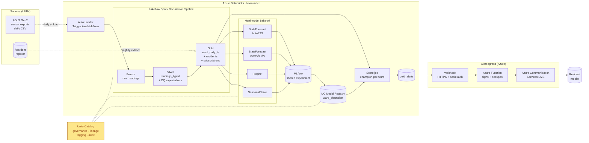
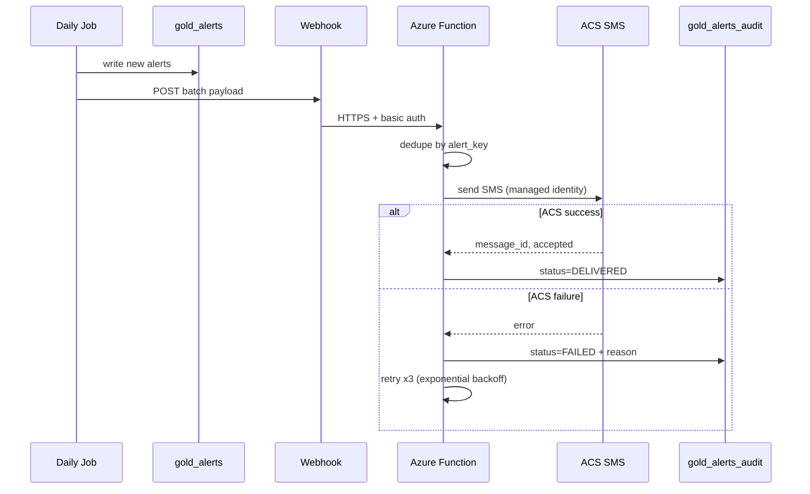

# Reference architecture

## End-to-end: batch ingest → forecast → SMS alert

## What governs what

| Concern | Where it's enforced |
|---------|---------------------|
| Access to sensor + resident data | UC table grants on `mbcl_catalog.th_air_quality.*` and `*.residents`; row filter on `subscriptions` (only opted-in) |
| Phone number column | UC column mask (full mask for analysts, plain text only for the alert service principal) |
| Cost attribution | Compute tags `team`, `project`, `env`; surfaced in the existing cost dashboard |
| Model promotion | UC Model Registry alias `champion@ward_<id>` set only via Asset Bundle on `main` |
| Alert audit trail | Every webhook payload + ACS response written to `gold_alerts_audit` (append-only Delta) |
| SMS opt-in | `subscriptions.opt_in_status = 'ACTIVE'` filter is the **only** path that produces an alert payload |

## Why an Azure Function fronts ACS

Databricks webhooks send HTTPS POSTs with basic auth, but ACS expects a managed-identity-authenticated call against the Communication Services REST API. The Function:

1. Authenticates to ACS using its own managed identity (no secrets in Databricks).
2. Re-signs / shapes the payload.
3. Deduplicates by `alert_key` (ward + DAQI band + day) so a re-run never doubles up.
4. Writes the ACS message ID + delivery status back to `gold_alerts_audit` via a small Lakebase or Delta sink.

This keeps the SMS credential out of the data platform and gives privacy a clean integration boundary.

## Failure / retry path

If the webhook itself fails, Databricks job notifications retry — and the next day's run is idempotent (`alert_key` already in audit → skipped).
